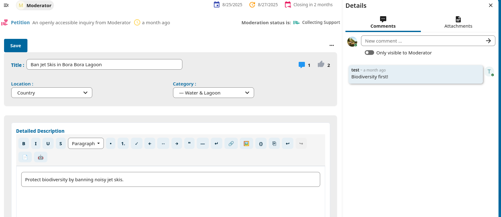
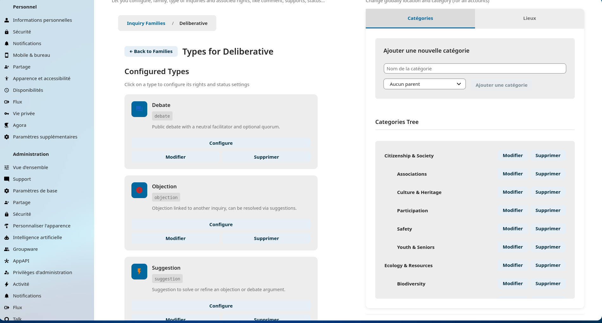
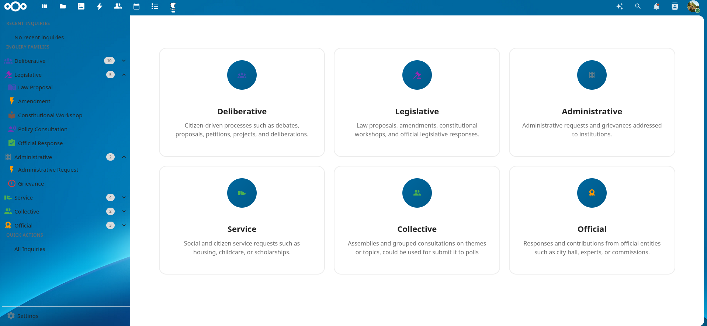
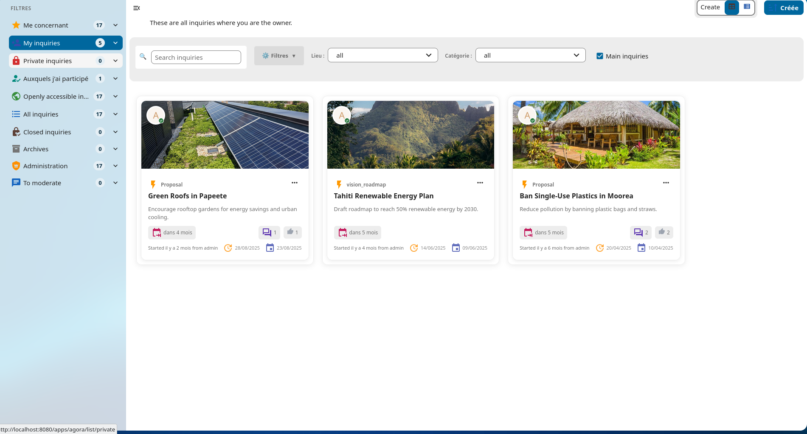
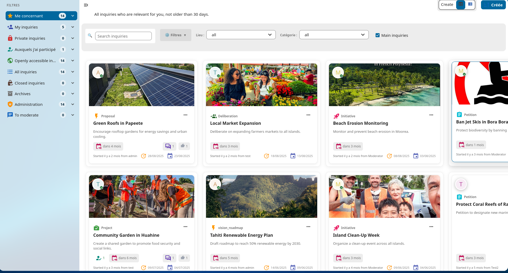
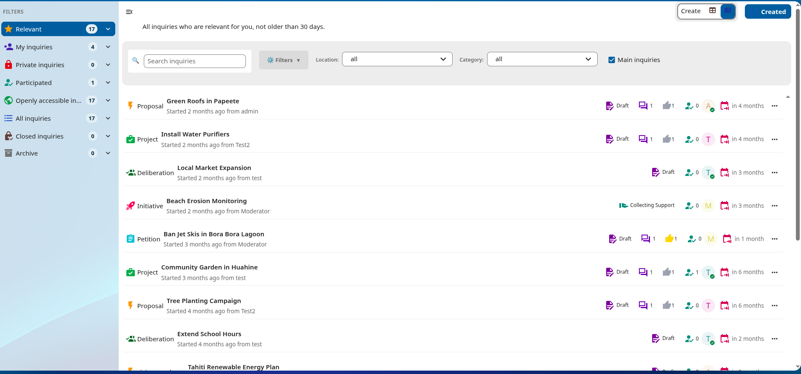
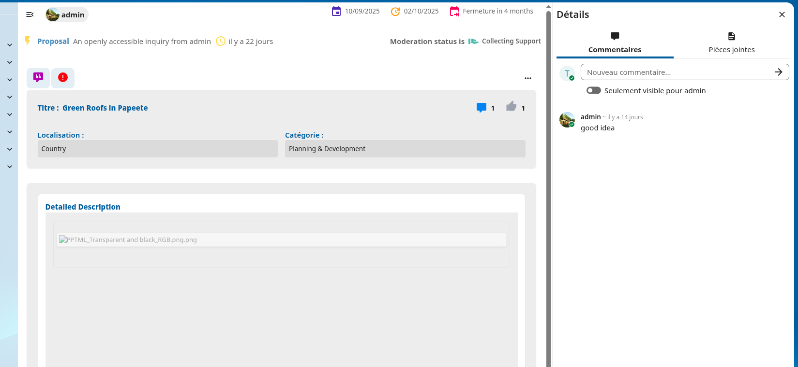
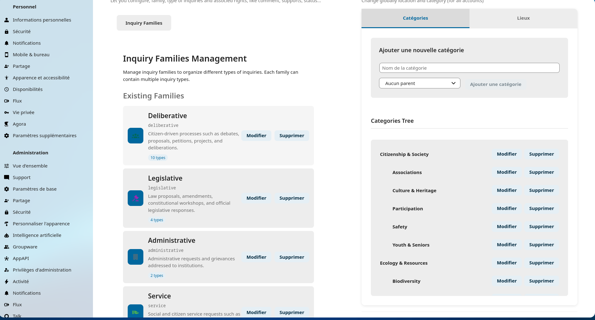
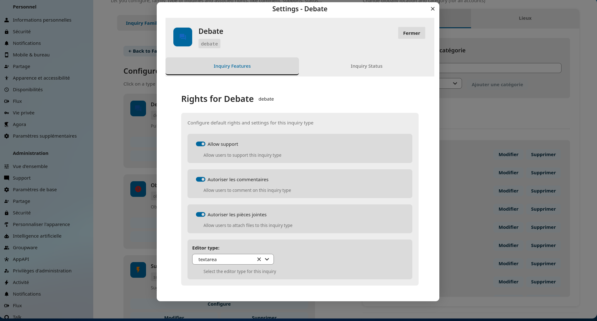

<!--
  - SPDX-FileCopyrightText: 2016 Nextcloud contributors
  - SPDX-License-Identifier: AGPL-3.0-or-later
-->

# Agora 1.5.0

[](https://dependabot.com)  
[](COPYING)  
[](https://api.reuse.software/info/github.com/vinimoz/agora)

Agora is a **Nextcloud app for participatory democracy**, built on [Nextcloud Polls](https://github.com/nextcloud/polls) and inspired by [Decidim](https://decidim.org/).  
It allows communities and organizations to collaborate on **proposals, debates, petitions, and projects** in a structured, inclusive way.

---

## 🌟 New Features in 1.5.0

- 🧱 **Architecture Database** – New database design for better scalability and structure  
- 🎨 **New UX Landing Page** – A more modern and user-friendly entry point  
- 🆔 **Cover ID for Inquiries** – Visual cover and unique identifiers  
- 🧩 **Linked Families** – Inquiries are now linked to families; create your own families  
- ⚙️ **Custom Inquiry Types** – Define reply formats and transformation possibilities  
- 🧑‍⚖️ **Real Moderation Mode** – Fully functional moderation (can be deactivated)  

---

## ✨ Features

- 💬 Comments and discussions  
- 👍 Supports (likes/upvotes)  
- 🤖 Create your own inquiries family.
- 🧩 Reply and transform inquiries.  
- 🔗 Attach files with your inquiries. 
- 🧾 Multiple inquiry types and customization (proposals, debates, petitions, projects,.... )  
- 📂 Categorization and filtering by location/family  
- 🔒 Secure and private – all data stays on your Nextcloud server  

---

## 🧭 Roadmap

- ⚙️ Integrate miscellaneous settings  
- 🔗 Link with other Nextcloud apps (Forms, Polls, Deck, Cospend…)  
- 🗣 Real debate features (structured replies, multi-thread discussions)  
- 📜 Project law reading with article-level comments and supports  
- 🏛 Collectives → Submit group of inquiries to Polls application for consultation or referendum  
- 🧮 Quorums and workflow automation  
- 🧰 Better permission control and moderation tools  

---

## 📥 Installation / Update

### Requirements

- Nextcloud 31+  
- PHP 8.1+

### Install Latest Release

Install directly from the [Nextcloud App Store](https://apps.nextcloud.com/apps/agora).

### From Git

```bash
git clone https://github.com/vinimoz/agora.git
cd agora
make setup-dev   # Dev environment
make setup-build # Runtime environment
npm run build    # Compile JS
make appstore    # Full build
occ app:enable agora
```

---

## ⚙ Useful OCC Commands

| Command | Description |
| ------- | ----------- |
| `agora:db:clean-migrations` | Remove obsolete migrations |
| `agora:db:purge` | Drop all Agora tables & config |
| `agora:db:rebuild` | Rebuild database including indices |
| `agora:db:init-default` | Create default categories, locations, moderation |
| `agora:index:create` | Create database indices |
| `agora:index:remove` | Remove indices |
| `agora:inquiry:transfer-ownership <source> <target>` | Transfer ownership of an inquiry |
| `agora:share:add / remove` | Add or remove user/group/email to shares |

---

## 🖼 Screenshots
## 🖼 Screenshots

| Creation | Edit Inquiry | Inquiry Type | Manage Category | Family | Grid View | Grid 2 | List View | Moderation Status | View as Non-owner | Settings | Settings Inquiry |
| :-------: | :----------: | :-----------: | :-------------: | :-----: | :-------: | :-----: | :-------: | :---------------: | :---------------: | :------: | :---------------: |
|  |  |  |  |  |  |  |  |  |  |  |  |

---

## 📚 Documentation

| User Guide | API Guide |
| :--------: | :-------: |
| [USER_GUIDE.md](docs/USER_GUIDE.md) | [API_v1.0.md](docs/API_v1.0.md) |

---

## 🛠 Support

- Report bugs or request features: [GitHub Issues](https://github.com/vinimoz/agora/issues)  
- Community support: [Nextcloud Help](https://help.vinimoz.com/c/apps/agora/)

---

## 🤝 Contribution

Please read our [Code of Conduct](https://vinimoz.com/community/code-of-conduct/) to ensure collaboration in a positive and respectful way.
